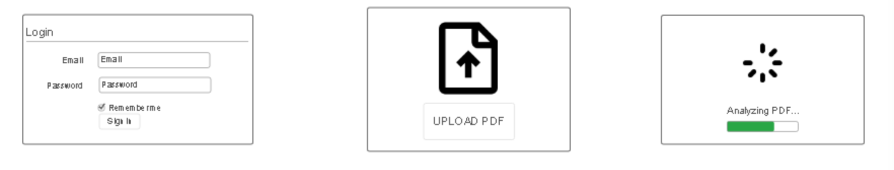

# Audit App

[My Notes](notes.md)

A web app that users can upload financial statements and recieve an AI audit. Specifically made for small businesses. Won't have all functionality in this class, but will be able to add OpenAI API calls.

> [!NOTE]
>  This is a template for your startup application. You must modify this `README.md` file for each phase of your development. You only need to fill in the section for each deliverable when that deliverable is submitted in Canvas. Without completing the section for a deliverable, the TA will not know what to look for when grading your submission. Feel free to add additional information to each deliverable description, but make sure you at least have the list of rubric items and a description of what you did for each item.

> [!NOTE]
>  If you are not familiar with Markdown then you should review the [documentation](https://docs.github.com/en/get-started/writing-on-github/getting-started-with-writing-and-formatting-on-github/basic-writing-and-formatting-syntax) before continuing.

## 🚀 Specification Deliverable

> [!NOTE]
>  Fill in this sections as the submission artifact for this deliverable. You can refer to this [example](https://github.com/webprogramming260/startup-example/blob/main/README.md) for inspiration.

For this deliverable I did the following. I checked the box `[x]` and added a description for things I completed.

- [x] Proper use of Markdown
- [x] A concise and compelling elevator pitch
- [x] Description of key features
- [x] Description of how you will use each technology
- [x] One or more rough sketches of your application. Images must be embedded in this file using Markdown image references.

### Elevator pitch

Small businesses also need to keep their finances in order. This app will allow users to upload their financial statements in PDF format and utilize AI to analyze the documents and highlight problem areas such as unexpected account balances or unexplained transactions.

### Design

### Key features

- Secure login
- File upload
- PDF file analysis through OpenAI API
- Results pop-up with real time updates

### Technologies

I am going to use the required technologies in the following ways.

- **HTML** - Two pages. One landing page with login. one with PDF Upload.
- **CSS** - Styling that is functional and professional.
- **React** - Provides login, file upload, results page popup, and displaying pdf.
- **Service** - Backend service with endpoints for
    - login
    - uploading files
    - calling OpenAI API to anaylze files
    - retrieving status
- **DB/Login** - Manages user data and authentication credentials securely.
- **WebSocket** - Real-time results from backend to frontend

## 🚀 AWS deliverable

For this deliverable I did the following. I checked the box `[x]` and added a description for things I completed.

- [x] **Server deployed and accessible with custom domain name** - [My server link](https://auditapp.click).

## 🚀 HTML deliverable

For this deliverable I did the following. I checked the box `[x]` and added a description for things I completed.

- [x] **HTML pages** - Created 3 html pages. One landing page, one upload page, and one login page.
- [x] **Proper HTML element usage** - used html elements to create a functional scaffolding.
- [x] **Links** - created links between pages, and a link to my github repo.
- [x] **Text** - Added textual content to explain webpage and elements.
- [x] **3rd party API placeholder** - created a placeholder for my api calls.
- [x] **Images** - I did not complete this part of the deliverable.
- [x] **Login placeholder** - created a placeholder for login in login.html.
- [x] **DB data placeholder** - created a placeholder for database of previously uploaded files in login.html.
- [x] **WebSocket placeholder** - created a placeholder for websocket messages from api call in upload.html.

## 🚀 CSS deliverable

For this deliverable I did the following. I checked the box `[x]` and added a description for things I completed.

- [x] **Header, footer, and main content body** - I created styling for each portion of my html.
- [x] **Navigation elements** - I styled navigation elements with a button that is green when hovered over.
- [x] **Responsive to window resizing** - Is responsive to window resizing.
- [x] **Application elements** - Styled it to taste.
- [x] **Application text content** - Styled my text to look professional.
- [x] **Application images** - Put my app logo in the upper left corner.

## 🚀 React part 1: Routing deliverable

For this deliverable I did the following. I checked the box `[x]` and added a description for things I completed.

- [x] **Bundled using Vite** - Used Vite to bundle my components.
- [x] **Components** - Created components for each html page.
- [x] **Router** - Added browser router to app.jsc.

## 🚀 React part 2: Reactivity deliverable

For this deliverable I did the following. I checked the box `[x]` and added a description for things I completed.

- [x] **All functionality implemented or mocked out** - I implemented all fucntionality and mocked out my other functionality like websocket and database access.
- [x] **Hooks** - Used useState and useEffect to implement functionality and make a framework for providing functionality in the future. Created a popup to do websocket messages while backend analyzes the file.

## 🚀 Service deliverable

For this deliverable I did the following. I checked the box `[x]` and added a description for things I completed.

- [x] **Node.js/Express HTTP service** - built service/index.js as a full express HTTP service for auth, uploading, login, etc.
- [x] **Static middleware for frontend** - static middleware efficiently handles files, and uses API behavior.
- [x] **Calls to third party endpoints** - calls OpenAI API for basic analysis. This is on the backend not the frontend but I have TA approval.
- [x] **Backend service endpoints** - multiple backend endpoints that handle registration, sign in and out, profile access, pdf upload, and retrieval of audit history.
- [x] **Frontend calls service endpoints** - replaced mock login/upload with real service flows.
- [x] **Supports registration, login, logout, and restricted endpoint** - /api/auth/create, /api/auth/login, and /api/auth/logout, with verifyAuth protecting /api/profile.

## 🚀 DB deliverable

For this deliverable I did the following. I checked the box `[x]` and added a description for things I completed.

- [x] **Stores data in MongoDB** - Stores pdf, audit data, and id to recall which audits in MongoDB
- [x] **Stores credentials in MongoDB** - stores user authentication, username, email, hashed password in MongoDB

## 🚀 WebSocket deliverable

For this deliverable I did the following. I checked the box `[x]` and added a description for things I completed.

- [x] **Backend listens for WebSocket connection** - Backend now wraps Express in an HTTP server and runs a WebSocket server. It listens for WebSocket connections.
- [x] **Frontend makes WebSocket connection** - useAuditUpdatesSocket connects to /ws when the user is authenticated
- [x] **Data sent over WebSocket connection** - real-time status updates sent over websocket connection
- [x] **WebSocket data displayed** - Data displayed in upload on a pop up window. messages are added to the log under the progress bar.
- [x] **Application is fully functional** - Fully functional for the requirements of the class.
